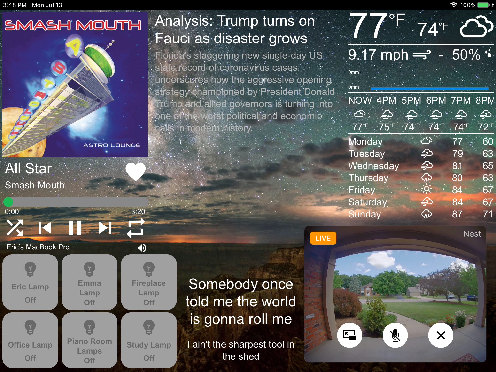

# Welcome to Homebridge-Display, the unofficial iPad display for Homebridge
Homebridge is amazing, but don't you wish there was a way to view it in a prettier, less developer focused dashboard?

With Homebridge-Display, you can control and view Spotify, see the weather forecast and current conditions, see news articles, control some homebridge devices, and even see realtime lyrics to whatever song is playing!

## Installation

Using the [Config UI X PLugin](https://github.com/oznu/homebridge-config-ui-x#readme) search for "homebridge display" and install it. Alternatively, install it from npm as homebridge-display

## Setup

- Your homebridge IP will be whatever local IP address is shown in the config UI along with a colon ":" and the port found in the Homebridge Config.
- The pin is the Apple HomeKit bridge pin you use to add Homebridge to your Home.
- To display the weather, register for a free API Key from [OpenWeather](https://openweathermap.org/api) and add your latitude and longitude
- Lastly, for Spotify control, register for [a free Spotify Developer Account](https://developer.spotify.com/dashboard/applications) and create an app. Be sure to add the callback url in the Spotify application to be the same one in both the RURL and the callback URL in auth_url

## Usage
Currently, this only displays properly on an iPad with screen resolution of  1024px by 768px, but other resolutions are in progress.

For best results, add this web app to your homescreen so that it may display in fullscreen.

## TODOs:
- Move Spotify, weather, and Homebridge update requests to server side to avoid maxing out api calls when multiple clients connect
- Add support for multiple music players
- Allow more customization of what is displayed on the screen with a sort of box approach
- Support multiple screen resolutions
- Dynamically change what is on the screen as programmable events occur
- Add a calculator widget, note taking widget, various calendar integrations, todo list integrations
- Add support for more HomeKit accessories like thermostats
- Rewrite the server-side code in TypeScript or JavaScript and integrate with Homebridge config
- Publish to NPM as a Homebridge plugin

For feature requests or bugs please create an issue!

## Support
I built this program for my own personal use, but I think other people may like it and use it, so I've made it public (although not all that user friendly)

If you would like to support this project please feel free to create a pull request, create an issue to submit and idea or feature request, or donate to help it continue running by either GitHub Sponsoring me or PayPal me at eric@andrechek.com.